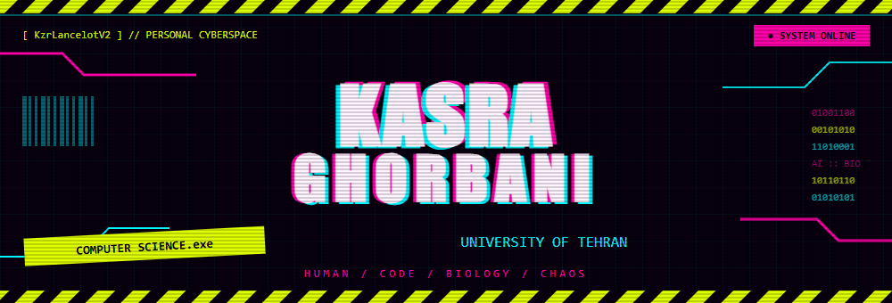
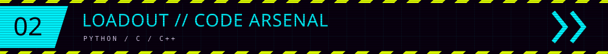
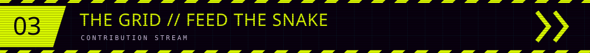
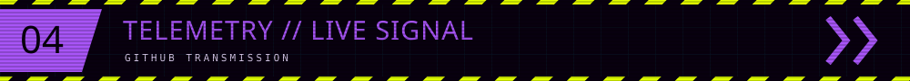
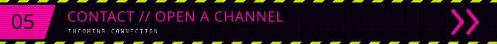

<!-- Upload README.md and assets/ together to KzrLancelotV2/KzrLancelotV2. -->

  
  

  
  
  
  
   
  

  
  
  

  <b>Kasra Ghorbani // Computer Science @ University of Tehran</b> 
  AI, computational biology, bioinformatics — and an unreasonable amount of neon.

  <a href="#interests">[ INTERESTS ]</a> &nbsp;
  <a href="#loadout">[ LOADOUT ]</a> &nbsp;
  <a href="#the-grid">[ THE GRID ]</a> &nbsp;
  <a href="#contact">[ CONTACT ]</a>

  
  
   
  
   
  
  
  
  

  
  &nbsp;  &nbsp;
  
    
  <code>PYTHON.exe</code> &nbsp; × &nbsp; <code>C.sys</code> &nbsp; × &nbsp; <code>C++.dll</code>

  <b>↓ EVERY GREEN SQUARE IS SNAKE FOOD ↓</b>  
  

  
  
    
  
  

   
  
  
    
  
  
   
  <code>[ END OF TRANSMISSION ]</code> 
  you survived the scroll. (ﾉ◕ヮ◕)ﾉ*:･ﾟ✧

